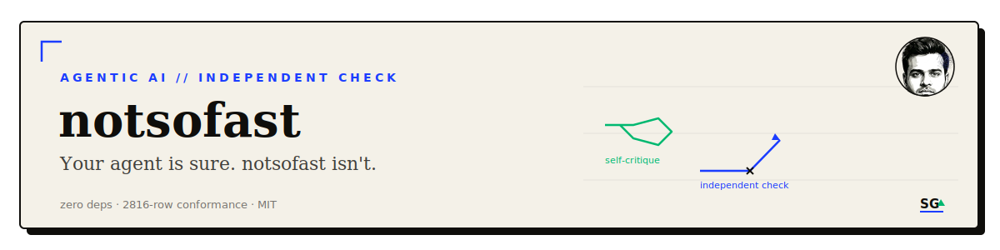
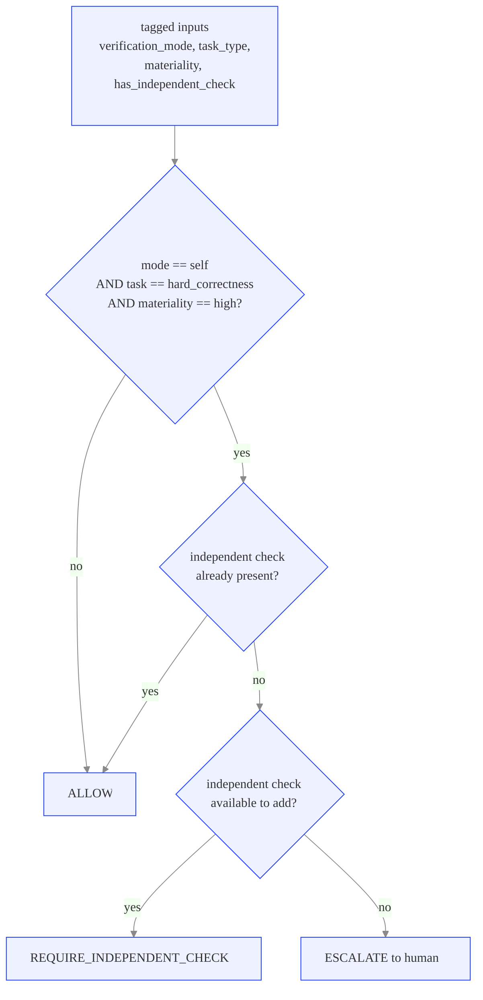

<div align="center">

<br/>


<br/>
<sub><a href="#what-it-does">What it does</a> · <a href="#results--demo">Results</a> · <a href="#install">Install</a> · <a href="#use--reproduce">Use</a> · <a href="#how-it-works">How it works</a> · <a href="#scope">Scope</a> · <a href="#license">License</a></sub>
</div>

---

## What it does

Agentic loops increasingly close on their own self-critique: the model writes an answer, the same
model reviews it, and the loop ships. That is the cheapest verification mode, and it is unsound on
exactly the decisions where being wrong is expensive. Huang et al. (ICLR 2024, arXiv:2310.01798) show
intrinsic self-correction is unreliable on hard-correctness tasks and can degrade accuracy; Denison et
al. (arXiv:2406.10162) show a self-improving loop can learn to game its own critic. Action-level
guardrails check whether an action is allowed; none of them check whether the judgment that approved
it was structurally capable of catching its own mistake.

notsofast enforces one narrow rule the action-level layer does not: a `self`-only verification mode is
not adequate as the sole gate on a `hard_correctness`, `high`-materiality decision. When that
combination fires, the call cannot stand on self-critique alone: it needs an independent check
(cross-model, held-out, tool, or human), or it escalates. Every other combination is left alone; the
contract is deliberately thin, restricting one unsafe pattern rather than adding a general review
layer.

It ships three ways from one source: a Claude Code plugin (`/plugin install`), a drop-in skill folder
(any agent that reads `SKILL.md` or `AGENTS.md`), and a pip-installable Python guard (any Python
environment). It composes with action-policy layers like AgentSpec and the Microsoft Agent Control
Specification rather than replacing them: those gate the action, this gates the epistemics of the
verification that approved it.

## Results / Demo

The companion study (`skills/notsofast/study/`) runs a seeded, transparent simulation of 1,000 loop
decisions through four policies, calling the real `notsofast.review()` for the routing. Token costs
and rework costs are explicit constants; the accuracy dynamics are calibrated to the Huang et al.
finding, not measured from live model runs: it is a labeled simulation, not a live-LLM benchmark.

| policy | tokens checking | tokens lost to rework | total | accuracy on what matters |
|---|---:|---:|---:|---:|
| ship, no validation | 1.40M | 1.21M | 2.61M | 0.55 |
| naive self-refine (K=4) | 3.00M | 1.37M | 4.37M | 0.49 |
| validate everything | 1.75M | 0.48M | 2.23M | 0.82 |
| **notsofast (routed)** | **1.58M** | **0.42M** | **2.00M** | **0.84** |

<div align="center">

</div>

notsofast comes out cheapest in total tokens and most accurate under these assumptions, at the same
time: 54 percent lower total cost than naive self-refine, 23 percent lower than shipping unchecked,
10 percent lower than validating everything, while matching validate-everything's accuracy by
escalating the cases it cannot check to a human rather than trusting a weaker automated check. Full
methodology, the break-even point, and what would move the result: [`skills/notsofast/study/STUDY.md`](skills/notsofast/study/STUDY.md).

Demo output from the runnable walkthrough ([`skills/notsofast/examples/quickstart.py`](skills/notsofast/examples/quickstart.py)):

```text
$ python skills/notsofast/examples/quickstart.py
== Scenario A: a credit-limit decision (hard-correctness, high-materiality), no checker wired ==
self-refine stopped after 1 pass(es); 4 futile pass(es) avoided; independent check -> held-out backtest + validator sign-off

== Scenario B: same decision, but no independent check is even available ==
self-refine stopped after 1 pass(es); escalated -> model-risk committee

== Scenario C: same decision, independent check already wired in ==
self-refine closed on self-critique after 1 pass(es) (call stands)

== Scenario D: marketing copy (soft, low-materiality) -> the guard stays out of the way ==
self-refine closed on self-critique after 1 pass(es) (call stands)

== Scenario E: unclassifiable decision -> conservative default (treated hard and high) ==
verdict=REQUIRE_INDEPENDENT_CHECK; mode=self, task=hard_correctness, materiality=high, independent_check=absent (...)
```

## Install

**Claude Code plugin:**

```text
/plugin marketplace add sarthakguptaquant/notsofast
/plugin install notsofast@sarthak-skills
```

```bash
# non-interactive equivalent
claude plugin marketplace add sarthakguptaquant/notsofast --scope user
claude plugin install notsofast@sarthak-skills --scope user
```

**Skill folder** (Claude Code, or any agent that reads `SKILL.md`):

```bash
curl -fsSL https://raw.githubusercontent.com/sarthakguptaquant/notsofast/main/install.sh | bash

# or, cloned:
git clone https://github.com/sarthakguptaquant/notsofast.git
cd notsofast && ./install.sh          # user scope:    ~/.claude/skills
./install.sh --project                # project scope: ./.claude/skills
```

**Python guard** (any environment, no dependencies):

```bash
pip install "git+https://github.com/sarthakguptaquant/notsofast.git"
```

## Use / Reproduce

```python
from notsofast import Decision, review, VerificationMode, TaskType, Materiality

review(Decision(
    verification_mode=VerificationMode.SELF,
    task_type=TaskType.HARD_CORRECTNESS,
    materiality=Materiality.HIGH,
    has_independent_check=False,
))
# -> "REQUIRE_INDEPENDENT_CHECK"
```

```bash
# run the walkthrough
python skills/notsofast/examples/quickstart.py

# run the test suite (11 cases)
python skills/notsofast/scripts/test_notsofast.py

# run the 2816-row conformance suite (full input cross-product + edge cases)
python skills/notsofast/scripts/test_notsofast_rigorous.py

# reproduce the case study and its figures
cd skills/notsofast/study && python run_study.py --plot && python flow_diagram.py
```

## How it works



Unclassified `task_type` or `materiality` resolves conservatively (`unknown` defaults to
`hard_correctness` and `high`), so an unlabeled decision routes to the safe side rather than passing
through by omission.

<details>
<summary><strong>The guard itself</strong></summary>

`skills/notsofast/scripts/notsofast.py` is standard-library Python: a `Decision` dataclass, a
`review()` function that is a pure function of the tagged inputs (no model call in the routing path,
so a verdict replays deterministically), and an `explain()` function that logs which fields defaulted.
Three verdicts only: `ALLOW`, `REQUIRE_INDEPENDENT_CHECK`, `ESCALATE`.

</details>

<details>
<summary><strong>The conformance suite</strong></summary>

`skills/notsofast/scripts/test_notsofast_rigorous.py` checks the full cross-product of
`verification_mode` × `task_type` × `materiality` × `has_independent_check` ×
`independent_check_available`, plus default-resolution, the self/hard/high hinge, non-self modes, the
bad-mode error path, determinism (same input, same output across repeated calls), `explain()` output,
and dataclass immutability: 2,816 rows in total, all against the shipped `review()`, not a mock.

</details>

<details>
<summary><strong>How this differs from action-policy and output-validation layers</strong></summary>

Agent-safety tooling clusters in two well-populated layers. Action-policy layers (AgentSpec, NVIDIA
NeMo Guardrails, and similar) specify which actions an agent may execute and block unsafe ones at
runtime: they gate the action. Output-validation layers (Guardrails AI, schema and policy validators)
check whether a model's output is well-formed, on-policy, and free of known defects: they gate the
output. notsofast gates the judgment: whether the verification step that approved a decision was
structurally independent enough, given how hard and how costly the decision is. The three layers
compose rather than overlap. In the self-correction literature, Reflexion (Shinn et al., NeurIPS 2023,
arXiv:2303.11366) and Self-Refine (Madaan et al., NeurIPS 2023, arXiv:2303.17651) are the canonical
single-model self-loops; notsofast does not improve them, it decides when running one counts as
adequate verification and routes to an independent check when it does not.

</details>

<details>
<summary><strong>Works with</strong></summary>

| Runtime | How |
|---|---|
| Claude Code | plugin (`/plugin install`) or skill folder in `~/.claude/skills` |
| Cursor, OpenAI Codex, other AGENTS.md-aware agents | clone the repo; the agent reads `AGENTS.md` |
| Any agent that reads `SKILL.md` folders | `./install.sh` into its skills directory |
| Any Python program | `pip install` the guard and call `review(...)` |

</details>

## Scope

**Claimed:** a deterministic specification plus a reference guard for one narrow pattern: a
self-only verification mode is not an adequate sole gate on a hard-correctness, high-materiality
decision. Standard-library Python, zero runtime dependencies, 11 unit tests, and a 2,816-row
conformance suite that checks the full input cross-product against the shipped code.

**Not claimed:** this is a specification with a reference implementation, not an empirically validated
mechanism against live model runs. The soft-versus-hard task classification is a judgment call the
caller makes (closed by a conservative default when unclassifiable, not by the guard inferring it).
The bundled case study is a seeded, labeled simulation calibrated to a published finding, not a
live-LLM benchmark, and no head-to-head accuracy or token claim is made against unlisted alternatives.
No MCP server is included or required: the guard has no external calls to connect to; one would only
become relevant if the skill is extended to reach a live service. Full limitations:
[`skills/notsofast/reference/CONTRACT.md`](skills/notsofast/reference/CONTRACT.md).

## License

MIT. See [LICENSE](LICENSE).

Authored by Sarthak Gupta, Data Scientist II, Finance Models, in a personal, industry-level capacity
using public sources and public frameworks. Contains no employer data or internals.

---

<div align="center">

<br/>
<sub><a href="https://github.com/sarthakguptaquant">sarthakguptaquant</a> · AI x quantitative finance · <a href="https://sarthakgpt.com">sarthakgpt.com</a></sub>
</div>
