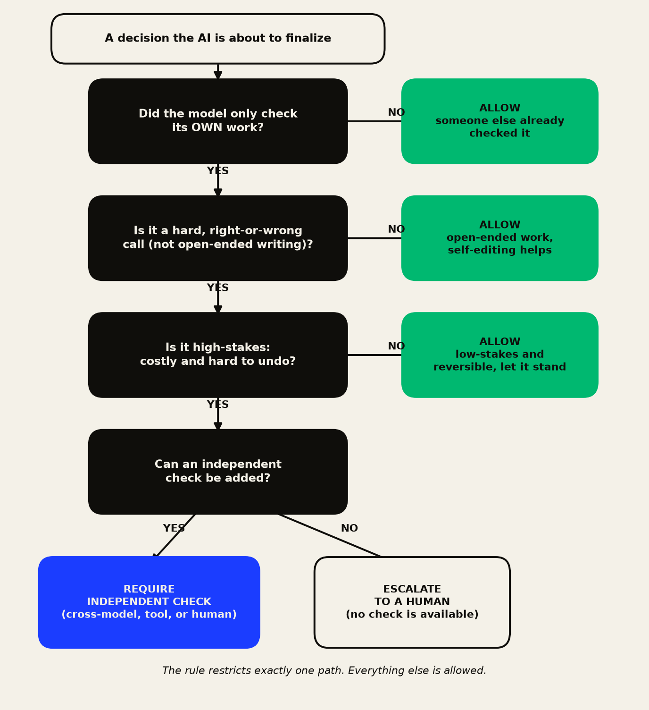
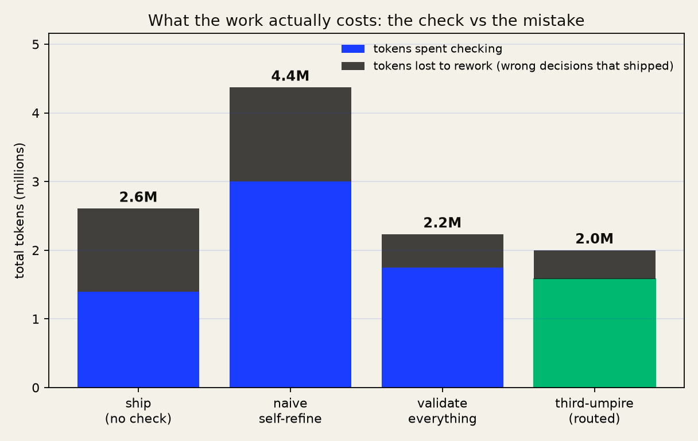
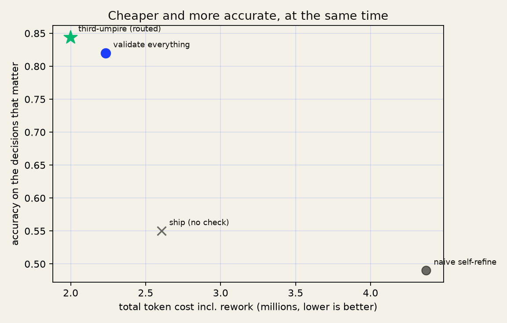

# Case study: validation is not the cost, the mistake is

The instinct is to ask "how many tokens does this check cost." That is the wrong question.
The right one is "how many tokens does the whole job cost," because a wrong consequential
decision that ships does not cost nothing. It triggers a rework cycle: someone catches it,
re-investigates, re-runs, corrects, signs off. That rework is real tokens and real money.
So the number that matters is:

> total cost = tokens spent checking + tokens lost to rework on decisions that shipped wrong

Read that way, a check stops looking like a cost line and starts looking like a cheap
hedge against an expensive mistake. This study puts numbers on it, honestly.

## How a decision gets routed (the plain-language version)

The guard restricts exactly one path: a model that only checked its own work, on a hard
right-or-wrong call, that is high-stakes. Everything else is allowed. When the rule does
fire, it asks for an independent check, or escalates to a human if none can be added.

## What this is, and is not

A transparent, fully seeded model. It calls the real `notsofast.review()` to do the
routing, so the policy under test is the shipped guard. Token costs and the rework cost are
explicit constants. The accuracy dynamics are calibrated to one published finding, not
measured from live model runs:

> Huang et al., "LLMs Cannot Self-Correct Reasoning Yet," ICLR 2024 (arXiv:2310.01798):
> intrinsic self-correction does not reliably improve hard-correctness answers and can
> degrade them.

It is not a live-LLM benchmark and does not pretend to be. A live replication (swap the
oracles for metered calls and a logged rework tally) is the natural next step, and the
harness is built so they drop in cleanly. To isolate exactly what the guard changes,
open-ended (soft) tasks are handled identically by every policy, so every token of
difference is attributable to the hard-task routing and nothing else.

Reproduce: `python run_study.py --plot` and `python flow_diagram.py`.

## The result

A population of 1,000 loop decisions. Four ways to handle the hard ones:

| policy | tokens checking | tokens lost to rework | total | accuracy on what matters |
|---|---:|---:|---:|---:|
| ship, no validation | 1.40M | 1.21M | 2.61M | 0.55 |
| naive self-refine (K=4) | 3.00M | 1.37M | 4.37M | 0.49 |
| validate everything | 1.75M | 0.48M | 2.23M | 0.82 |
| **notsofast (routed)** | **1.58M** | **0.42M** | **2.00M** | **0.84** |

**notsofast is the cheapest total, and the most accurate under these assumptions, at the
same time.** Net savings on the whole work structure: **54% versus the naive self-refine loop,
23% versus shipping with no check, 10% versus checking everything.** It beats validate-everything
not by checking less carefully but by not paying for a check on low-stakes reversible decisions,
while still catching the consequential ones and escalating the few it cannot check. That
escalation is where its accuracy edge comes from, and it rests on one stated assumption: that a
human reviewer catches more errors than an independent check (HUMAN_CATCH 0.90 above CHECK_CATCH
0.60). If an independent check were as good as a human, validate-everything would match notsofast
on accuracy while still losing on total cost. This run uses one fixed seed (20260617); only the
rework-cost constant was swept, in the break-even analysis below, and only within that one seed.
The cost win holds in that swept range wherever rework is expensive, and the accuracy win holds
wherever the check is weaker than a human, but neither claim has been re-run across multiple
seeds or across the other model constants.

The naive self-refinement loop is the worst of both worlds: it spends the most on checking
and still ships the most wrong answers, because self-refining a hard answer does not fix
it, it just re-endorses it.

## The honest break-even

The whole result rests on rework being expensive. So: how cheap would rework have to be
before skipping validation actually wins? The model answers it. **Once a wrong consequential
decision costs more than about 2,000 tokens to clean up, routing the check beats shipping
nothing.** A real correction cycle, several passes plus a human loop, runs far above that.
Below it, validation genuinely is not worth it, and the guard says so by allowing
low-materiality work to pass untouched.

## What would move the result

The accuracy claims rest on the cited finding. If intrinsic self-correction did reliably
fix hard answers, the naive loop would not collapse and the gap would shrink. Token totals
scale with the per-primitive constants; the ordering does not, as long as a self-refine
pass costs something, does not fix hard errors, and rework costs more than a single check.

Two inequalities are load-bearing. HUMAN_HANDOFF (200) below INDEP_CHECK (700) is what makes
escalation cheaper than a check and drives the cost win. HUMAN_CATCH (0.90) above CHECK_CATCH
(0.60) is what makes escalation more accurate than full validation and drives the accuracy win.
The both-win result holds only while both hold: flip either and the corresponding edge goes away.

Everything is in `run_study.py` and `study_results.json`. Change an assumption, re-run.

Personal capacity, industry-level. No employer data, internal figures, or system names
appear anywhere in this study or the code.
